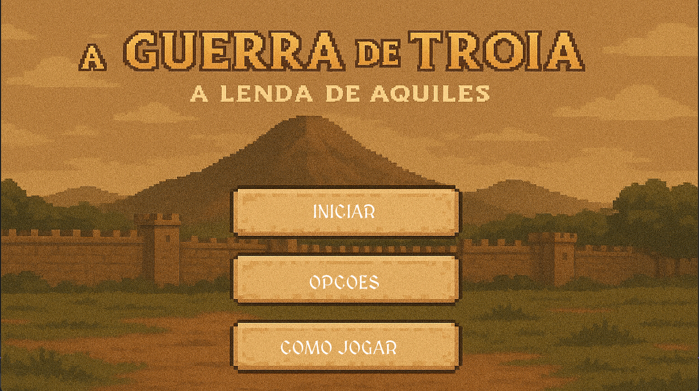
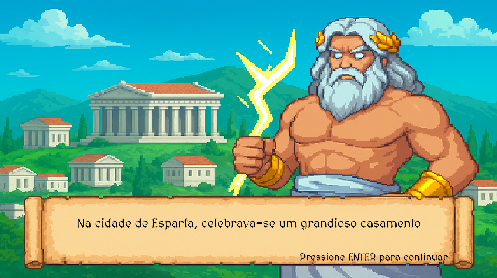
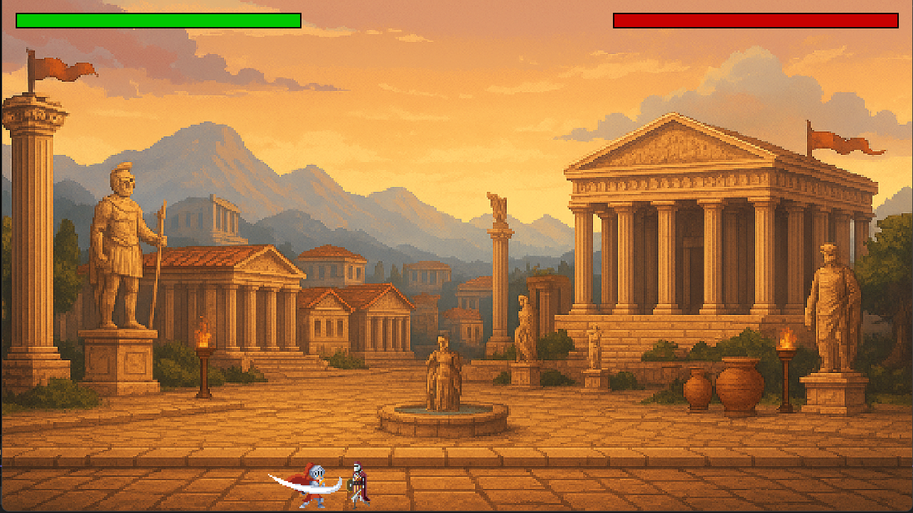
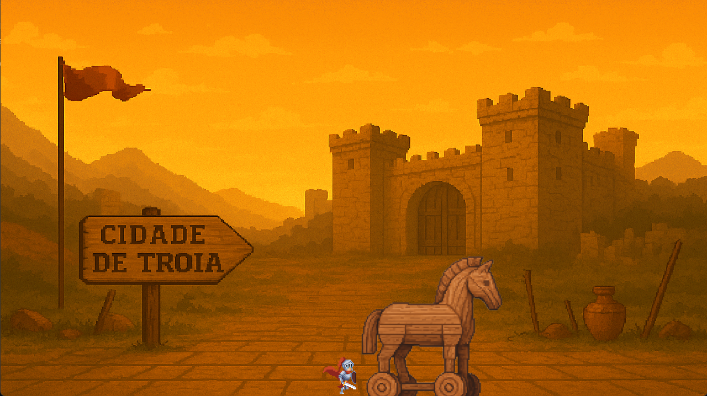

# 🏛 A Odisseia do Conhecimento

Este projeto tem como objetivo *"gameficar"* o aprendizado. Utilizando a linguagem C como base e a biblioteca Allegro, foi possível integrar ao aprendizado da mitologia histórica tudo o que um jogo PVE pode oferecer: Colisão, diálogos, batalhas, movimentação, gravidade e muita diversão!

# 📸 Capturas de tela
*Interface inicial com opções de jogo*

*Introdução narrativa à Guerra de Troia*

*Combate PVE com mecânicas de ataque*

*Encontro icônico com o Cavalo de Troia*

## 💻 Desenvolvedores

 - [Bruno Saldanha](https://github.com/saldanhabruno12) | [LinkedIn](https://www.linkedin.com/in/saldanhabrunol/)
 - [Luan Dias](https://github.com/LuanDiias) | [LinkedIn](https://www.linkedin.com/in/luan-dias-081b622a1/)

## 📋 Funcionalidades

 - Movimentação do personagem
 - IA simples para ações do inimigo
 - Colisões por meio de hitbox
 - Sistema de fases

## 🛠 Tecnologias utilizadas

 - C
 - Allegro 5
 - Git e Github

## 📚 O que Aprendemos
Desenvolvendo esse projeto, foi possível aprender a ideia por trás de qualquer jogo, percebendo assim todas as nuances que circundam o universo dos games. Aqui cito algumas: 

 - Escolha de Sprites e cenários
 - Temporizadores
 - Integração com periféricos (teclado e mouse)
 - Cálculo de colisão
 - Funções de movimentação e ataque
 - Mudanças de estados
 - Alocação de memória

Além disso tudo, o aprendizado mais valioso foi a divisão de tarefas e mesclagem de códigos de pessoas diferentes. Anteriormente, já havíamos trabalhado com Git e Github, porém esse projeto foi o maior que trabalhamos até o momento, servindo como uma imensa bagagem para ideias futuras. Trabalhar em grupo é exatamente a forma como o  mundo gira, com cada pessoa fazendo parte dessa engrenagem  gigantesca que é a sociedade.

## 💡 Principais desafios

 - Gerenciar tempo entre tarefas
 - Identificar e presumir possibilidades de gameplays com cenários improváveis
 - Criar fases de modo a conversar com a história da Guerra de Troia
 - Idealizar os Boss e seus movimentos autônomos 

## 🎮 Como jogar

Para testar você mesmo, é possível rodar esse projeto em seu Visual Studio!
Basta clonar esse repositório, instalar o pacote Allegro 5 em seu Visual Studio e depurar o código.
Para clonar o repositório, insira esse comando em sua gitbash:

git clone https://github.com/saldanhabruno12/Marajo.git

Acessando a main será possível aproveitar a jornada de aprendizado de maneira leve e interessante!
## 📄 Licença
Este projeto foi desenvolvido exclusivamente para fins acadêmicos e educacionais, e não possui fins comerciais.

## 📬 Contato

Caso queira dar feedback, contribuir ou tirar dúvidas, entre em contato com qualquer um dos integrantes do grupo pelos perfis do GitHub ou LinkedIn listados acima.

